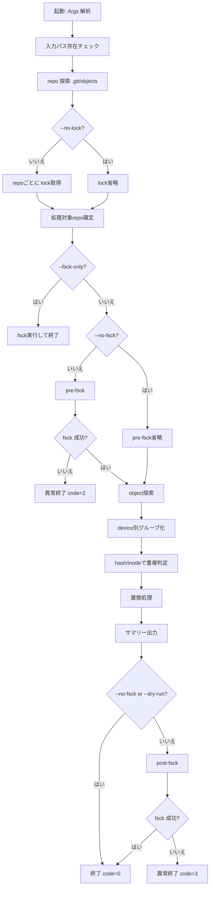

# git-share-obj 技術ドキュメント（処理フロー）

本ドキュメントは `git-share-obj` の実装ベースの処理フローと安全機構を説明する。
対象は UNIX 系環境（Linux/macOS）である。

## 1. 目的

`git-share-obj` は、探索対象配下の複数 Git リポジトリにある同一オブジェクトをハードリンク共有し、容量削減を狙う。

- 対象: `.git/objects/xx/yyyy...`（loose object）
- 対象外: `.git/objects/pack`, `.git/objects/info`
- 破壊的操作: あり（置換）
- 安全対策: lock, fsck, rollback

## 2. モジュール責務

- `src/main.rs`
  - エントリポイント。`Args` をパースして `app::run` を呼ぶ。
- `src/app.rs`
  - 全体オーケストレーション（検証、探索、lock、fsck、置換、集計表示）。
- `src/scanner.rs`
  - リポジトリ探索、オブジェクト探索、重複判定。
- `src/lock.rs`
  - リポジトリ単位ロック（lock file + `flock`）。
- `src/fsck.rs`
  - `git fsck --full` 実行と結果収集。
- `src/hardlink.rs`
  - `rename` 退避を使った安全寄り置換。
- `src/i18n.rs`
  - 日英メッセージ。

## 3. 実行フロー（通常モード）

## 4. fsck-only フロー

`--fsck-only` 指定時はハードリンク処理を行わず、ロック（`--no-lock` で省略可）と fsck のみ実行する。

- 成功: `code=0`
- 失敗あり: `code=2`

## 5. ロック設計

### 5.1 方式

各リポジトリで以下を使用する。

- ロックファイル: `.git/objects/git-share-obj.lock`
- OS ロック: `flock(LOCK_EX | LOCK_NB)`

### 5.2 意図

- 同一 repo を同時に処理する別プロセスを抑止する。
- lock 取得失敗 repo は対象外にし、処理続行可。

### 5.3 制約

- advisory lock のため、相手側がロックを無視する実装だと完全防止にはならない。
- Git 本体の全操作と厳密同期するものではない。

## 6. 置換・ロールバック設計

旧実装の `remove -> hard_link` は失敗時消失リスクが高いため、以下へ変更。

1. `target` を `target.git-share-obj.bak` へ `rename`
2. `hard_link(source, target)`
3. 成功時: `*.bak` を削除
4. 失敗時:
   - 部分生成 `target` があれば削除
   - `*.bak` を `target` に戻す（rollback）

`ReplaceResult` は `RolledBack` / `RollbackFailed` を含み、後者は常時エラー出力対象。

## 7. 重複判定ロジック

1. `.git/objects` から loose object を列挙
2. デバイス ID ごとに分割（ハードリンク不可境界）
3. ハッシュごとにグループ化
4. `(device, inode)` でサブグループ化
5. 最大サブグループを source 側に選ぶ
6. source 以外を置換対象 duplicates とする

## 8. 進捗表示（verbose）

`-v` 時は以下を表示。

- 探索ルート
- 一定間隔ごとの探索中ディレクトリ
- lock 開始/成功
- fsck 開始/成功
- 重複グループ数、置換詳細

ロールバック失敗・ロック失敗・fsck失敗は `-v` に関係なく出力する。

## 9. 終了コード

- `0`: 成功
- `1`: 入力パス不正
- `2`: pre-fsck 失敗 または fsck-only で失敗あり
- `3`: post-fsck 失敗

## 10. 既知の限界

- `flock` は協調的ロックであり、無視するプロセスの破壊を止められない。
- repo全体の完全停止（Git daemon/他ツール）までは保証しない。
- loose object 前提。pack object の重複最適化は対象外。
